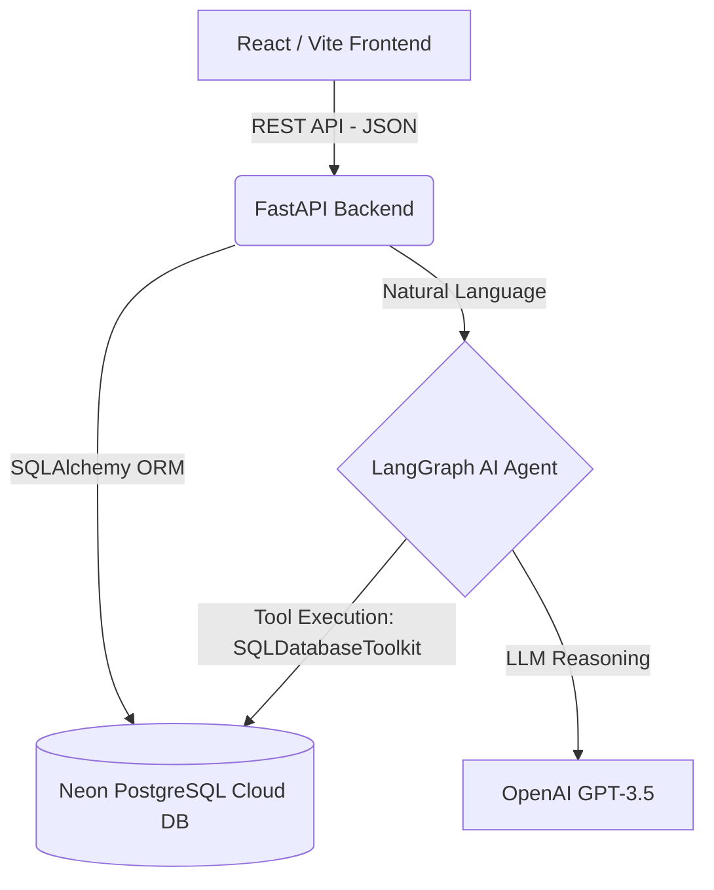

# Intuit-Style Personal Finance Dashboard (AI-Powered)


## Overview
This project is an enterprise-grade, full-stack personal finance dashboard inspired by core Intuit products like QuickBooks and Mint. It features a responsive React frontend, a high-performance Python FastAPI backend, and a cloud-native PostgreSQL database.

The standout feature of this architecture is an **embedded Agentic AI** powered by **LangGraph** and OpenAI, which enables "Text-to-SQL" capabilities. Users can query their financial data using natural language, and the AI autonomously reasons, generates, and executes secure SQL queries against the live database to return accurate financial insights.

---

## 🏗 System Architecture



---

## 🛠 Technical Stack & Industry Standards

### 1. Frontend (The Presentation Layer)
*   **React + Vite:** Industry standard for fast, component-based UI rendering.
*   **Recharts:** For dynamic, real-time financial data visualization.
*   **Design System:** Built using custom CSS variables, glassmorphism, and responsive grid layouts to match premium SaaS aesthetics.

### 2. Backend (The Application Layer)
*   **Python + FastAPI:** Chosen for its asynchronous capabilities, automatic Swagger documentation (`/docs`), and native Pydantic validation.
*   **RESTful Design:** Clean API endpoint structure (`/api/transactions`, `/api/summary`, `/api/chat`).
*   **CORS Management:** Strict Cross-Origin Resource Sharing middleware configured for secure cloud communication between Vercel and Render.

### 3. Database (The Data Layer)
*   **PostgreSQL (Neon):** Migrated from local SQLite to a serverless cloud PostgreSQL instance to support concurrent connections and cloud deployments.
*   **SQLAlchemy ORM:** Used for safe database migrations, session management, and protecting against SQL injection attacks.

### 4. Generative AI (The Intelligence Layer)
*   **LangGraph Orchestration:** Unlike simple RAG (Retrieval-Augmented Generation) applications, this uses an *Agentic* architecture. The LangGraph agent maintains state, iterates through reasoning loops, and autonomously selects tools (SQL execution) to answer complex user queries.
*   **OpenAI GPT-3.5:** Acts as the reasoning engine for the LangGraph agent.

---

## 🚀 Scalability & Enterprise Readiness

This application was engineered with enterprise scalability in mind:

1.  **Microservice Compatibility:** The frontend and backend are completely decoupled. They communicate exclusively via REST APIs, meaning the backend can be scaled horizontally behind a load balancer without affecting the frontend.
2.  **Containerization (Docker):** Full infrastructure-as-code has been implemented. Both the React frontend and Python backend have optimized `Dockerfiles`, orchestrated by a `docker-compose.yml` file. This guarantees perfect environment parity across Dev, Staging, and Production.
3.  **Cloud-Native Deployment:** 
    *   Frontend deployed to **Vercel** via edge networks for ultra-low latency globally.
    *   Backend deployed to **Render** for scalable container hosting.
    *   Database hosted on **Neon** for serverless auto-scaling and connection pooling.

---

## 🔮 Future Enhancements (Roadmap to Production)

While this project demonstrates strong architectural foundations, a true production rollout would include:
1.  **Authentication & Authorization:** Integrating OAuth2/OIDC (via Auth0 or AWS Cognito) and implementing Row-Level Security (RLS) in PostgreSQL to ensure the AI agent can only query data belonging to the authenticated `user_id`.
2.  **Automated Testing:** Implementing `PyTest` for backend endpoint coverage and `Jest/Cypress` for frontend integration tests.
3.  **Infrastructure Orchestration:** Moving from `docker-compose` to Kubernetes (K8s) manifests for automated health checks, rolling updates, and pod scaling.

---

## 💻 Local Development Setup

### Option 1: Using Docker (Recommended)
1. Ensure Docker Desktop is running.
2. Add your `.env` file to the `backend/` directory.
3. Run `docker-compose up --build`.

### Option 2: Manual Setup
**Backend:**
```bash
cd backend
python -m venv venv
source venv/bin/activate  # Or `venv\Scripts\activate` on Windows
pip install -r requirements.txt
uvicorn main:app --reload
```

**Frontend:**
```bash
cd frontend
npm install
npm run dev
```
